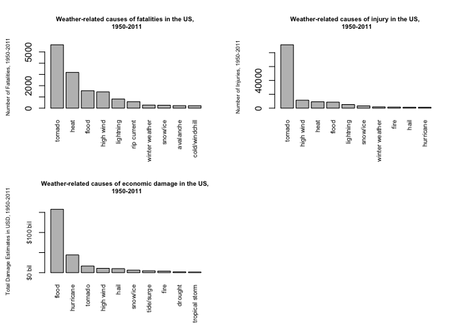
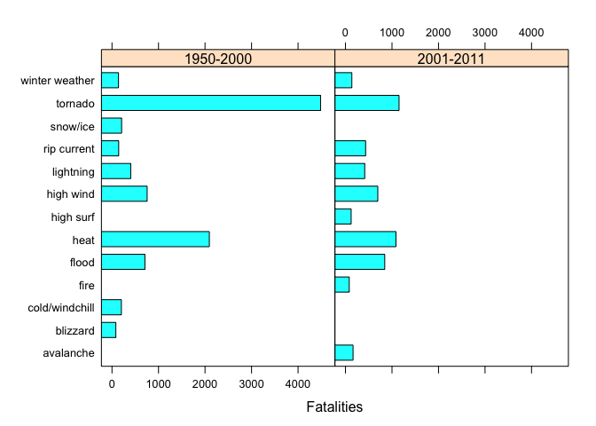

# Weather-related health and economic impacts in the US, 1950-2011


## Synopsis:
An analysis of reported weather-related health and economic impacts in the US over the years 1950-2011 demonstrates that overall, tornadoes have been the #1 reported cause of death and injury, while floods have had the most economic impact. Analyzing trends over time, however, reveals that reporting bias may come into play:  fewer events were reported over the entire span betwee 1950-2000 than in the single decade 2001-2011. Looking just at the most recent data and at the fatality outcome as an example, we see that tornadoes no longer greatly outpace other weather-related events (such as heat and floods) as far as reported mortality is concerned.

### Loading packages

```r
library(plyr)
library(dplyr)
```

```
## 
## Attaching package: 'dplyr'
## 
## The following objects are masked from 'package:plyr':
## 
##     arrange, desc, failwith, id, mutate, summarise, summarize
## 
## The following objects are masked from 'package:stats':
## 
##     filter, lag
## 
## The following objects are masked from 'package:base':
## 
##     intersect, setdiff, setequal, union
```

```r
library(lubridate)
```

```
## 
## Attaching package: 'lubridate'
## 
## The following object is masked from 'package:plyr':
## 
##     here
```

# Data Processing

### Loading and Processing the Raw data

We download the data from the course website for Reproducible Research. Note that https:// URLs are not supported by download.file by default, but using method = "curl" permits the download. Also we use "bzfile" in the read.csv argument since the file is a bz2 file.


```r
temp <- tempfile()
download.file("https://d396qusza40orc.cloudfront.net/repdata%2Fdata%2FStormData.csv.bz2", temp, method = "curl")
data <- read.csv(bzfile(temp, "repdata%2Fdata%2FStormData.csv.bz2"), header = TRUE)
unlink(temp)
```

Let's have a look at the data. First of all I prefer having variables in lowercase

```r
data2 <- data ## remove this later, just so I don't have to keep reading in the file
names(data2) <- tolower(names(data2))
data2 <- data2[,c("bgn_date", "state", "evtype",  "fatalities", "injuries", "propdmg", "propdmgexp", "cropdmg", "cropdmgexp")]


names(data2)
```

```
## [1] "bgn_date"   "state"      "evtype"     "fatalities" "injuries"  
## [6] "propdmg"    "propdmgexp" "cropdmg"    "cropdmgexp"
```

```r
data2$evtype <- tolower(data2$evtype)
length(unique(data2$evtype))
```

```
## [1] 898
```

It seems there are a lot of different event types that will make the analysis more difficult. Let's first try to remove some extraneous event types and then to combine names that refer to the same category.


```r
## remove extraneous event types 
event_pattern <- "(summary|\\?|other|none|month|no severe)"
data2$index <- grepl(event_pattern, data2$evtype)
data2 <- data2[!data2$index == TRUE,] # remove daily summaries and unknown types


## group similar event types together 
data2$evtype <- gsub(" ", "_", data2$evtype)
data2$evtype2 <- data2$evtype

thunder_pattern <- "(thund|microburst|tstm|tunder|thuder)"
data2$evtype2 <- ifelse(grepl(thunder_pattern, data2$evtype) == TRUE, "thunderstorm", data2$evtype2)

hurricane_pattern <- "(hurricane|typhoon)"
data2$evtype2 <- ifelse(grepl(hurricane_pattern, data2$evtype) == TRUE, "hurricane", data2$evtype2)

tropical_storm_pattern <- "tropical_storm"
data2$evtype2 <- ifelse(grepl(tropical_storm_pattern, data2$evtype) == TRUE, "tropical storm", data2$evtype2)

drought_pattern <- "(dry|driest|record_low_rainfall)"
data2$evtype2 <- ifelse(grepl(drought_pattern, data2$evtype) == TRUE, "drought", data2$evtype2)

cold_pattern <- "(cold|wind_chill|windchill|record_low|low_temp)"
data2$evtype2 <- ifelse(grepl(cold_pattern, data2$evtype) == TRUE, "cold/windchill", data2$evtype2)

heat_pattern <- "(heat|hot|warm|record_temperature|hyperthermia|temperature_record|record_high)"
data2$evtype2 <- ifelse(grepl(heat_pattern, data2$evtype) == TRUE, "heat", data2$evtype2)

surf_pattern <- "surf"
data2$evtype2 <- ifelse(grepl(surf_pattern, data2$evtype) == TRUE, "high surf", data2$evtype2)

tornado_pattern <- "nado|torn"
data2$evtype2 <- ifelse(grepl(tornado_pattern, data2$evtype) == TRUE, "tornado", data2$evtype2)

hail_pattern <- "(hail|ice_pellets)"
data2$evtype2 <- ifelse(grepl(hail_pattern, data2$evtype) == TRUE, "hail", data2$evtype2)

flood_pattern <- "(flood|fld)"
data2$evtype2 <- ifelse(grepl(flood_pattern, data2$evtype) == TRUE, "flood", data2$evtype2)

rain_pattern <- "(rain|record_precipitation|wet)"
data2$evtype2 <- ifelse(grepl(rain_pattern, data2$evtype) == TRUE, "heavy rain", data2$evtype2)

avalanche_pattern <- "avalan"
data2$evtype2 <- ifelse(grepl(avalanche_pattern, data2$evtype) == TRUE, "avalanche", data2$evtype2)

blizzard_pattern <- "blizz"
data2$evtype2 <- ifelse(grepl(blizzard_pattern, data2$evtype) == TRUE, "blizzard", data2$evtype2)

fire_pattern <- "fire"
data2$evtype2 <- ifelse(grepl(fire_pattern, data2$evtype) == TRUE, "fire", data2$evtype2)

winter_pattern <- "winter"
data2$evtype2 <- ifelse(grepl(winter_pattern, data2$evtype) == TRUE, "winter weather", data2$evtype2)

frost_pattern <- "(frost|freez)"
data2$evtype2 <- ifelse(grepl(frost_pattern, data2$evtype) == TRUE, "frost/freeze", data2$evtype2)

sleet_pattern <- "sleet"
data2$evtype2 <- ifelse(grepl(sleet_pattern, data2$evtype) == TRUE, "sleet", data2$evtype2)

fog_pattern <- "fog"
data2$evtype2 <- ifelse(grepl(fog_pattern, data2$evtype) == TRUE, "fog", data2$evtype2)

lightning_pattern <- "(lightning|ligntning)"
data2$evtype2 <- ifelse(grepl(lightning_pattern, data2$evtype) == TRUE, "lightning", data2$evtype2)

snow_ice_pattern <- "(snow|ice)" # note many events list both so hard to distinguish
data2$evtype2 <- ifelse(grepl(snow_ice_pattern, data2$evtype) == TRUE, "snow/ice", data2$evtype2)

tide_pattern <- "(high_tide|surge)"
data2$evtype2 <- ifelse(grepl(tide_pattern, data2$evtype) == TRUE, "tide/surge", data2$evtype2)

wind_pattern <- "wind"
data2$evtype2 <- ifelse(grepl(wind_pattern, data2$evtype) == TRUE, "high wind", data2$evtype2)

ripcurrent_pattern <- "rip_current"
data2$evtype2 <- ifelse(grepl(ripcurrent_pattern, data2$evtype) == TRUE, "rip current", data2$evtype2)

length(unique(data2$evtype2))
```

```
## [1] 128
```
This is much more manageable.

Next we have to evaluate the economic damage by combining variables referring to property and crop damage.


```r
# put the property and crop damage amounts into new variables 
# assume "B" = billion, "M" = million, "K" = thousand, "H" = hundred, and digits mean 10^x
# can't determine what "-", "?", "+" so change to NA
data3 <- data2

data3$propdmgexp <-mapvalues(data3$propdmgexp, from = c("m", "M", "h", "H", "K", "B", "-", "+", "?"), to = c("6", "6", "2", "2", "3", "9", NA, NA, NA))

data3$cropdmgexp <- mapvalues(data3$cropdmgexp, from = c("k", "K", "m","M", "B", "?"), to = c("3", "3", "6", "6", "9", NA))

data3$property_dollars <- data3$propdmg *10^(as.numeric(as.character(data3$propdmgexp)))
data3$crop_dollars <- data3$cropdmg *10^(as.numeric(as.character(data3$cropdmgexp)))
data3$all_dollars <- data3$property_dollars + data3$crop_dollars

# take the sum of the relevant variables
event_sums <- data3 %.% group_by(evtype2) %.% summarise_each(funs(sum(., na.rm = TRUE)), fatalities, injuries, all_dollars)
```

# Results

## Question 1:
### Across the United States, which types of events (as indicated in the EVTYPE variable) are most harmful with respect to population health?


## Question 2:
### Across the United States, which types of events have the greatest economic consequences?


```r
event_sums %.% arrange(desc(fatalities))
```

```
## Source: local data frame [128 x 4]
## 
##           evtype2 fatalities injuries  all_dollars
## 1         tornado       5636    91407  16570396463
## 2            heat       3179     9243    496753200
## 3           flood       1552     8681 157760144487
## 4       high wind       1451    11498  10765962470
## 5       lightning        817     5232    320786130
## 6     rip current        577      529         1000
## 7  winter weather        277     1876   1077465700
## 8        snow/ice        261     3277   6285437250
## 9       avalanche        225      170      2385800
## 10 cold/windchill        221      279      4610000
## ..            ...        ...      ...          ...
```

```r
top_deaths <- event_sums %.% arrange(desc(fatalities))
top_injuries <- event_sums %.% arrange(desc(injuries))

# plot the top 10 causes of death in a barplot
par(mfrow = c(2,2))
barplot(top_deaths$fatalities[1:10], ylab = "Number of Fatalities, 1950-2011", names.arg = top_deaths$evtype2[1:10], cex.names = 0.7, las = 3, cex.lab = 0.6)
title(main = "Weather-related causes of fatalities in the US, \n 1950-2011", cex.main = 0.7)

# plot the top 10 causes of injury in a barplot
barplot(top_injuries$injuries[1:10], ylab = "Number of Injuries, 1950-2011", names.arg = top_injuries$evtype2[1:10], cex.names = 0.7, las = 3, cex.lab = 0.6)
title(main = "Weather-related causes of injury in the US, \n 1950-2011", cex.main = 0.7)

event_sums %.% arrange(desc(all_dollars))
```

```
## Source: local data frame [128 x 4]
## 
##           evtype2 fatalities injuries  all_dollars
## 1           flood       1552     8681 157760144487
## 2       hurricane        133     1333  44220000800
## 3         tornado       5636    91407  16570396463
## 4       high wind       1451    11498  10765962470
## 5            hail         15     1371  10049210590
## 6        snow/ice        261     3277   6285437250
## 7      tide/surge         24       43   4644418000
## 8            fire         90     1608   3838549570
## 9         drought          3       32   1886540000
## 10 tropical storm         66      383   1530352350
## ..            ...        ...      ...          ...
```

```r
top_econ <- event_sums %.% arrange(desc(all_dollars))

# plot the top 10 causes of economic damage in a barplot
barplot(top_econ$all_dollars[1:10], ylab = "Total Damage Estimates in USD, 1950-2011", names.arg = top_econ$evtype2[1:10], cex.names = 0.7, las = 3, axes = FALSE, cex.lab = 0.6)
title(main = "Weather-related causes of economic damage in the US, \n 1950-2011", cex.main = 0.7)
pts <- pretty(top_econ$all_dollars[1:10]/1000000000) # in billions
axis(2, at = axTicks(2), labels = paste0("$",pts[1:4], " bil"), cex.axis = 0.7)
```

 

The #1 weather-related cause of fatalities between 1950 and 2011 was tornado, with 5636 total fatalities over this period. 


The #1 weather-related cause of human injury in this period was likewise "tornado", with 9.1407\times 10^{4} total injuries reported. 


The #1 weather-related cause of economic damage between 1950 and 2011 was flood, with USD $157.8 Billion in total economic damages over this period. 

### Have these results changed over time?

```r
# split events into two groups: 1950-2000; 2001-2011
data3$date_period <- ifelse(year(mdy_hms(data3$bgn_date)) < 2001, 1, 2)
hist(data3$date_period, main = "Events Reported by Date Period", xlab = "Date Period", xaxt = "n", breaks = 4, col = "gray")
axis(1, at = c(1, 2), labels = c("1950-2000", "2001-2011"))
```

 

As one can see, there are fewer events reported during the entire 50-year period from 1950-2000 than in the last 10 years of reporting (2001-2011). Have the types of events with the most damaging consequences changed over time? Let's investigate the fatalities as an example.


```r
# plot by time period
data3$date_period_pretty <- ifelse(year(mdy_hms(data3$bgn_date)) < 2001, "1950-2000", "2001-2011")
event_sums2 <- data3 %.% group_by(evtype2, date_period_pretty) %.% summarise_each(funs(sum(., na.rm = TRUE)), fatalities, injuries, all_dollars)

top_deaths2 <- 
  event_sums2 %.%
  arrange(desc(fatalities)) 


library(lattice)


barchart(evtype2 ~ fatalities|date_period_pretty, data = top_deaths2[1:20,], xlab = "Fatalities")
```

 

Here, we can see that tornadoes no longer greatly outpace other weather-related events (such as heat and floods) as far as reported mortality is concerned.
